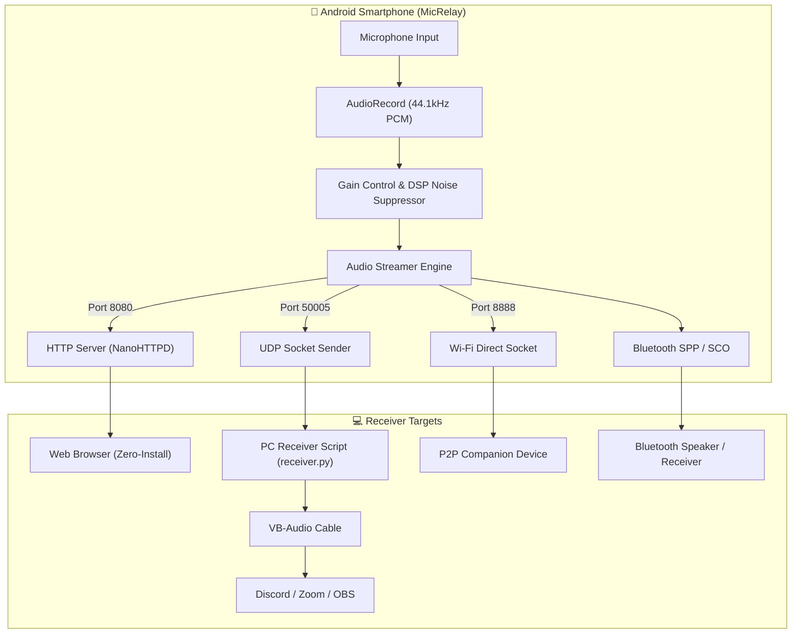

# 🎙️ MicRelay - Wireless Android Microphone

[](https://kotlinlang.org)
[](https://developer.android.com)
[](https://developer.android.com/jetpack/compose)
[](LICENSE)

**MicRelay** turns your Android smartphone into a high-quality, low-latency wireless microphone. Stream live audio from your phone's microphone to any PC, Mac, Linux machine, or Smart TV over **Local Wi-Fi (LAN)**, **Wi-Fi Direct (P2P)**, or **Bluetooth**.

---

## 🌟 Key Features

- **🌐 Zero-Install Web Receiver**: Built-in HTTP audio server (`http://<phone-ip>:8080`). Open the live stream on any web browser (Chrome, Edge, Safari, Firefox) without installing any software on your PC.
- **⚡ Low-Latency UDP Streaming**: Raw PCM 16-bit 44.1kHz audio output over UDP for minimal audio delay—ideal for Discord, OBS Studio, Zoom, and gaming.
- **📱 Wi-Fi Direct (P2P)**: Connect directly peer-to-peer without needing a router or internet connection.
- **📶 Bluetooth Audio**: Supports Bluetooth RFCOMM/SPP sockets and Bluetooth SCO headset audio routing.
- **🎛️ Real-Time Audio Controls**:
  - **Gain Multiplier Slider**: Boost microphone input sensitivity up to 300% (+10dB).
  - **DSP Noise Suppression**: Hardware-accelerated background noise filtering.
  - **Mute Switch**: Instant mic mute toggle.
- **📊 Live Audio Visualizer**: Real-time waveform canvas and VU peak level meter.
- **📲 QR Code Connection**: On-screen QR code matrix generation for instant mobile-to-PC connection scanning.

---

## 🏗️ Architecture



---

## 🚀 Quick Start Guide

### 1. Android App Setup
1. Clone the repository and build using Android Studio or Gradle:
   ```bash
   git clone https://github.com/hawlzz/MicRelay.git
   cd MicRelay
   ./gradlew assembleDebug
   ```
2. Install the compiled APK on your phone:
   ```bash
   adb install app/build/outputs/apk/debug/app-debug.apk
   ```

---

### 2. Connection Options

#### Option A: Web Browser Player (Zero-Install)
1. Open **MicRelay** on your phone and tap **Start Broadcast**.
2. Connect your PC to the same Wi-Fi network as your phone.
3. Open any web browser on your PC and enter the URL shown on your phone screen:
   ```
   http://<YOUR-PHONE-IP>:8080
   ```
   *(Or tap **Show QR Code** in the app and scan it with your PC/phone camera!)*
4. Click **Connect & Play Live Stream**.

---

#### Option B: Low-Latency PC UDP Receiver (For Discord/Zoom/OBS)
1. Navigate to the `pc_receiver` directory and install Python dependencies:
   ```bash
   cd pc_receiver
   pip install -r requirements.txt
   ```
2. View available audio output devices:
   ```bash
   python receiver.py --list-devices
   ```
3. Start receiving live audio over UDP:
   ```bash
   python receiver.py --port 50005
   ```
4. **Virtual Audio Cable Setup (Optional)**: Install [VB-Audio Cable](https://vb-audio.com/Cable/) and run:
   ```bash
   python receiver.py --device <CABLE_INPUT_DEVICE_ID>
   ```
   Select **CABLE Output** as your Microphone Input in Discord, Zoom, or OBS.

---

#### Option C: Wi-Fi Direct (P2P - Routerless)
1. Select the **Wi-Fi P2P** tab in the app.
2. Tap **Scan Peers** to discover nearby devices outdoor or without a Wi-Fi router.

---

#### Option D: Bluetooth Audio Routing
1. Pair your phone with your Bluetooth PC or headset.
2. Select the **Bluetooth** tab in MicRelay.
3. Toggle **Bluetooth SCO Headset Routing** to route phone mic audio directly.

---

## 📂 Project Structure

```
MicRelay/
├── app/
│   ├── src/main/
│   │   ├── AndroidManifest.xml
│   │   └── java/com/example/phonemic/
│   │       ├── MainActivity.kt                # Main Activity & Permission handler
│   │       ├── audio/
│   │       │   ├── AudioRecorderManager.kt     # Low-latency AudioRecord & DSP engine
│   │       │   └── AudioVisualizerState.kt     # Waveform & amplitude state
│   │       ├── network/
│   │       │   ├── HttpAudioServer.kt         # NanoHTTPD web audio streamer & HTML player
│   │       │   ├── UdpStreamer.kt             # UDP socket streaming engine
│   │       │   └── WifiP2pConnectionManager.kt# Wi-Fi Direct discovery & socket
│   │       ├── bluetooth/
│   │       │   └── BluetoothMicManager.kt     # Bluetooth SPP & SCO routing
│   │       ├── ui/
│   │       │   ├── components/
│   │       │   │   └── AudioMeter.kt          # Animated Canvas waveform visualizer
│   │       │   └── screens/
│   │       │       └── MainScreen.kt          # Jetpack Compose dashboard
│   │       └── utils/
│   │           └── NetworkUtils.kt            # IP resolution & ZXing QR code matrix
│   └── build.gradle.kts
├── pc_receiver/
│   ├── receiver.py                            # Python low-latency receiver script
│   ├── requirements.txt                       # Python dependencies
│   └── README.md                              # Detailed PC setup guide
├── build.gradle.kts
├── settings.gradle.kts
└── README.md
```

---

## 📜 License

This project is licensed under the MIT License - see the [LICENSE](LICENSE) file for details.
