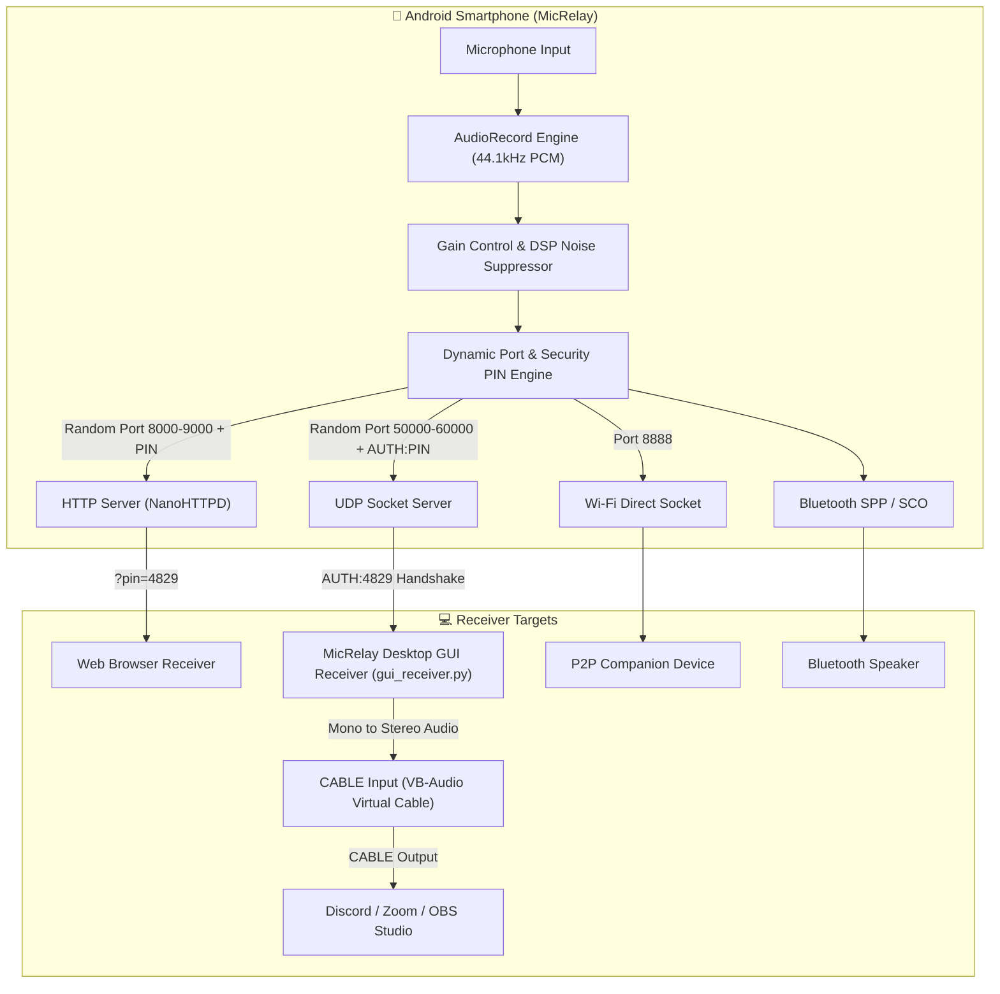

# 🎙️ MicRelay - Wireless Android Microphone

[](https://kotlinlang.org)
[](https://developer.android.com)
[](https://developer.android.com/jetpack/compose)
[](LICENSE)

**MicRelay** turns your Android smartphone into a high-quality, low-latency wireless microphone. Stream live audio from your phone's microphone to any PC, Mac, Linux machine, or Smart TV over **Local Wi-Fi (LAN)**, **Wi-Fi Direct (P2P)**, or **Bluetooth**.

---

## 🌟 Recent Updates & Key Features

- **🔒 Security PIN Authentication**: All streams require a 4-digit **Security PIN** (e.g. `4829`). Unauthenticated HTTP stream attempts receive `HTTP 401 Unauthorized`. UDP stream requires a two-way `AUTH:<PIN>` handshake before client IP authorization.
- **🎲 Dynamic Random Port Selection**: Automatically binds to a dynamic random HTTP port (`8000`–`9000`) and UDP port (`50000`–`60000`) on server startup. Features an on-demand **"New PIN & Ports"** refresh button.
- **🖥️ Desktop GUI Receiver Application (`pc_receiver/gui_receiver.py`)**: Modern dark-mode Windows GUI app featuring:
  - **Audio Device Dropdown**: Select Speakers, Headphones, or **VB-Audio Virtual Cable**.
  - **Multi-Channel Stereo Routing**: Automatic mono-to-stereo channel duplication for full VB-Audio Cable compatibility.
  - **Native Sample Rate Matching**: Automatic 44.1kHz / 48kHz device sample rate detection.
  - **Live VU Audio Level Meter**: Animated volume visualizer bar.
  - **Output Gain / Volume Slider**: Adjust PC playback volume (0% to 200%).
- **📲 Dynamic QR Code**: Scanning the on-screen QR Code automatically embeds the randomized URL (`http://<ip>:<port>/?pin=<pin>`) for 0-click connection.
- **🌐 Zero-Install Web Receiver**: Accessible via any web browser (Chrome, Edge, Safari, Firefox) with an interactive Security PIN prompt.
- **📱 Wi-Fi Direct (P2P) & Bluetooth**: Support for routerless P2P streaming and Bluetooth SCO headset audio routing.

---

## 🏗️ System Architecture



---

## 🚀 Quick Start Guide

### 1. Android App Installation
1. Clone the repository and build:
   ```bash
   git clone https://github.com/hawlzz/MicRelay.git
   cd MicRelay
   ./gradlew assembleDebug
   ```
2. Install the compiled APK on your phone:
   ```bash
   adb install app/build/outputs/apk/debug/app-debug.apk
   ```

---

### 2. PC Desktop GUI Receiver Setup (Recommended for Discord / OBS / Zoom)

1. Navigate to the `pc_receiver` directory and install Python dependencies:
   ```bash
   cd pc_receiver
   pip install -r requirements.txt
   ```
2. Launch the **Desktop GUI Receiver**:
   ```bash
   python gui_receiver.py
   ```
3. Enter your phone's **IP Address**, **Dynamic Port**, and **Security PIN** displayed on your phone screen.
4. Select your **Audio Output Device**:
   - For direct listening: Select your PC Speakers / Headphones.
   - For Discord/Zoom/OBS: Select **`CABLE In (VB-Audio Virtual Cable)`**.
5. Click **CONNECT & START RECEIVER**.

---

### 3. How to Setup MicRelay as Microphone Input in Discord

1. Download & Install [VB-Audio Virtual Cable](https://vb-audio.com/Cable/) (Free for Windows).
2. In **MicRelay Desktop GUI Receiver**, set **Audio Output Device** to:
   `CABLE In 16ch (VB-Audio Virtual Cable)`
3. In **Discord Voice Settings** (`Settings -> Voice & Video`):
   - Set **Input Device** (Thiết bị đầu vào) to: **`CABLE Output (VB-Audio Virtual Cable)`**.
   - Under **Noise Suppression** (Chặn tiếng ồn): Change from **Krisp** to **Standard** or **Disabled**.
   - Enable **Automatically determine input sensitivity** (Tự động điều chỉnh độ nhạy đầu vào).

---

### 4. Zero-Install Web Receiver Option

1. Open **MicRelay** on your phone and tap **Start Broadcast**.
2. Open any web browser on your PC/laptop connected to the same Wi-Fi:
   ```
   http://<YOUR-PHONE-IP>:<RANDOM-PORT>/?pin=<SECURITY-PIN>
   ```
   *(Or tap **Show QR Code** in the app and scan it with your phone/PC camera!)*
3. Click **Connect & Play Live Stream**.

---

## 📂 Project Structure

```
MicRelay/
├── app/
│   ├── src/main/
│   │   ├── AndroidManifest.xml
│   │   └── java/com/example/phonemic/
│   │       ├── MainActivity.kt                # Activity, dynamic credentials, permission handler
│   │       ├── audio/
│   │       │   ├── AudioRecorderManager.kt     # Low-latency AudioRecord & DSP engine
│   │       │   └── AudioVisualizerState.kt     # Waveform & amplitude state
│   │       ├── network/
│   │       │   ├── HttpAudioServer.kt         # NanoHTTPD web audio streamer with PIN auth
│   │       │   ├── UdpStreamer.kt             # UDP socket streaming with AUTH:PIN handshake
│   │       │   └── WifiP2pConnectionManager.kt# Wi-Fi Direct discovery & socket
│   │       ├── bluetooth/
│   │       │   └── BluetoothMicManager.kt     # Bluetooth SPP & SCO routing
│   │       ├── ui/
│   │       │   ├── components/
│   │       │   │   └── AudioMeter.kt          # Animated Canvas waveform visualizer
│   │       │   └── screens/
│   │       │       └── MainScreen.kt          # Jetpack Compose dashboard with PIN Card
│   │       └── utils/
│   │           └── NetworkUtils.kt            # Random ports, PIN generator & ZXing QR code
│   └── build.gradle.kts
├── pc_receiver/
│   ├── gui_receiver.py                        # Desktop GUI Receiver (Tkinter + SoundDevice)
│   ├── receiver.py                            # CLI Receiver script with PIN & UDP auth
│   ├── requirements.txt                       # Python dependencies
│   └── README.md                              # PC receiver setup guide
├── build.gradle.kts
├── settings.gradle.kts
└── README.md
```

---

## 📜 License

This project is licensed under the MIT License - see the [LICENSE](LICENSE) file for details.
